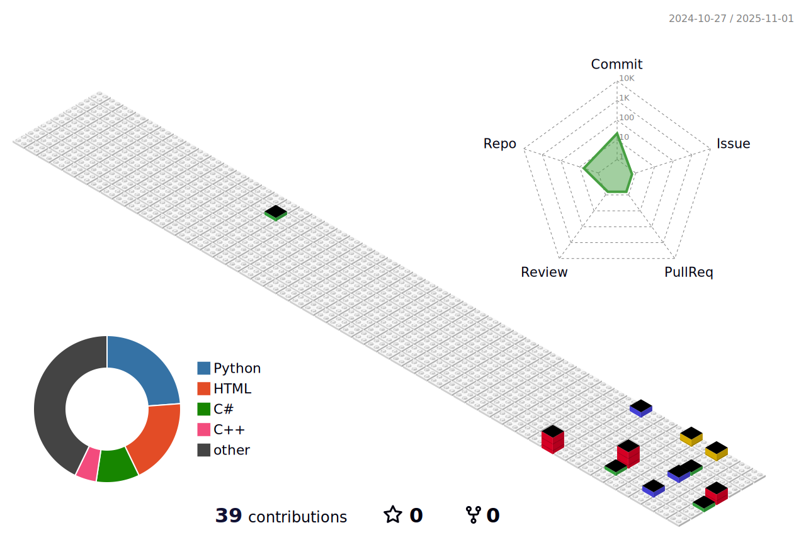

<h1 align="center">Hi, I'm Prince Raut </h1>

  

   Building digital experiences one commit at a time 
   Turning ideas into scalable solutions 
   Passionate about clean code and innovative tech 
   Watch my contributions get eaten by this cool snake!  

  <picture>
    <source media="(prefers-color-scheme: dark)" srcset="https://raw.githubusercontent.com/PrinceRaut01/PrinceRaut01/output/github-contribution-grid-snake-dark.svg">
    <source media="(prefers-color-scheme: light)" srcset="https://raw.githubusercontent.com/PrinceRaut01/PrinceRaut01/output/github-contribution-grid-snake.svg">
    
  </picture>

  <strong> My GitHub Universe in 3D</strong>

<picture>
  <source media="(prefers-color-scheme: dark)" srcset="profile-3d-contrib/profile-night-green.svg">
  <source media="(prefers-color-scheme: light)" srcset="profile-3d-contrib/profile-green-animate.svg">
  
</picture>

<blockquote align="center">
  Open source is a galaxy — every contribution is a shining star.
</blockquote>

---

<h2 align="center"> About Me</h2>

  

   Hey there! I'm <strong>Prince Raut</strong>, a passionate <em>developer And an IT-Engineer</em>  
  Always curious, always learning, and always building cool stuff 

---

-  **GitHub ID:** [PrinceRaut01](https://github.com/PrinceRaut01)   
-  **Full Name:** Prince Raut
-  **Email:** [princerautit21@gmail.com](mailto:princerautit21@gmail.com)
-  **Quote:** "Code is like humor. When you have to explain it, it’s bad."

---

  ⚡ <em>"Code is like art — every line tells a story."</em> 

---

<h2 align="center"> Current Goals & Roadmap</h2>

 2025 Goals (Click to expand)

- [ ] Contribute to an open-source project
- [ ] Build and deploy a full-stack application
- [ ] Earn GitHub achievements & badges
- [ ] Grow to 50+ contributions
- [ ] Share knowledge through blogs or tutorials

---

<h2 align="center"> GitHub Analytics</h2>

  <picture>
    <source media="(prefers-color-scheme: dark)" srcset="https://github-readme-stats.vercel.app/api?username=PrinceRaut01&show_icons=true&theme=github_dark&hide_border=true&rank_icon=github&include_all_commits=true&count_private=true" />
    <source media="(prefers-color-scheme: light)" srcset="https://github-readme-stats.vercel.app/api?username=PrinceRaut01&show_icons=true&theme=default&hide_border=true&rank_icon=github&include_all_commits=true&count_private=true" />
    
  </picture>
  <picture>
    <source media="(prefers-color-scheme: dark)" srcset="https://github-profile-summary-cards.vercel.app/api/cards/profile-details?username=PrinceRaut01&theme=github_dark&hide_border=true" />
    <source media="(prefers-color-scheme: light)" srcset="https://github-profile-summary-cards.vercel.app/api/cards/profile-details?username=PrinceRaut01&theme=default&hide_border=true" />
    
  </picture> 
  <picture>
    <source media="(prefers-color-scheme: dark)" srcset="https://github-contributor-stats.vercel.app/api?username=PrinceRaut01&limit=5&theme=github_dark&combine_all_yearly_contributions=true&hide_border=true" />
    <source media="(prefers-color-scheme: light)" srcset="https://github-contributor-stats.vercel.app/api?username=PrinceRaut01&limit=5&theme=default&combine_all_yearly_contributions=true&hide_border=true" />
  </picture>
  <picture>
    <source media="(prefers-color-scheme: dark)" srcset="https://github-readme-stats.vercel.app/api/top-langs/?username=PrinceRaut01&theme=github_dark&hide_border=true&include_all_commits=true&count_private=true&layout=donut" />
    <source media="(prefers-color-scheme: light)" srcset="https://github-readme-stats.vercel.app/api/top-langs/?username=PrinceRaut01&theme=default&hide_border=true&include_all_commits=true&count_private=true&layout=donut" />
    
  </picture> 
  <picture>
    <source media="(prefers-color-scheme: dark)" srcset="https://github-profile-summary-cards.vercel.app/api/cards/repos-per-language?username=PrinceRaut01&theme=github_dark&hide_border=true" />
    <source media="(prefers-color-scheme: light)" srcset="https://github-profile-summary-cards.vercel.app/api/cards/repos-per-language?username=PrinceRaut01&theme=default&hide_border=true" />
    
  </picture>
  <picture>
    <source media="(prefers-color-scheme: dark)" srcset="https://github-profile-summary-cards.vercel.app/api/cards/most-commit-language?username=PrinceRaut01&theme=github_dark&hide_border=true" />
    <source media="(prefers-color-scheme: light)" srcset="https://github-profile-summary-cards.vercel.app/api/cards/most-commit-language?username=PrinceRaut01&theme=default&hide_border=true" />
    
  </picture> 
  <picture>
    <source media="(prefers-color-scheme: dark)" srcset="https://github-profile-summary-cards.vercel.app/api/cards/productive-time?username=PrinceRaut01&theme=github_dark&hide_border=true&utcOffset=5.45" />
    <source media="(prefers-color-scheme: light)" srcset="https://github-profile-summary-cards.vercel.app/api/cards/productive-time?username=PrinceRaut01&theme=default&hide_border=true&utcOffset=5.45" />
    
  </picture>
  <picture>
    <source media="(prefers-color-scheme: dark)" srcset="https://github-readme-streak-stats.herokuapp.com?user=PrinceRaut01&theme=github_dark_blue&short_numbers=true&hide_border=true&mode=weekly" />
    <source media="(prefers-color-scheme: light)" srcset="https://github-readme-streak-stats.herokuapp.com?user=PrinceRaut01&theme=default&short_numbers=true&hide_border=true&mode=weekly" />
    
  </picture>

---

<h2 align="center"> Let's Connect</h2>

  
  

---

<h2 align="center"> Dev Quotes</h2>

  <picture>
    <source media="(prefers-color-scheme: dark)" srcset="https://quotes-github-readme.vercel.app/api?type=horizontal&theme=radical">
    <source media="(prefers-color-scheme: light)" srcset="https://quotes-github-readme.vercel.app/api?type=horizontal&theme=default">
    
  </picture>

---

  <strong> "Code with purpose, build with passion, and let every commit tell your story."</strong> 
  — Prince Raut 

